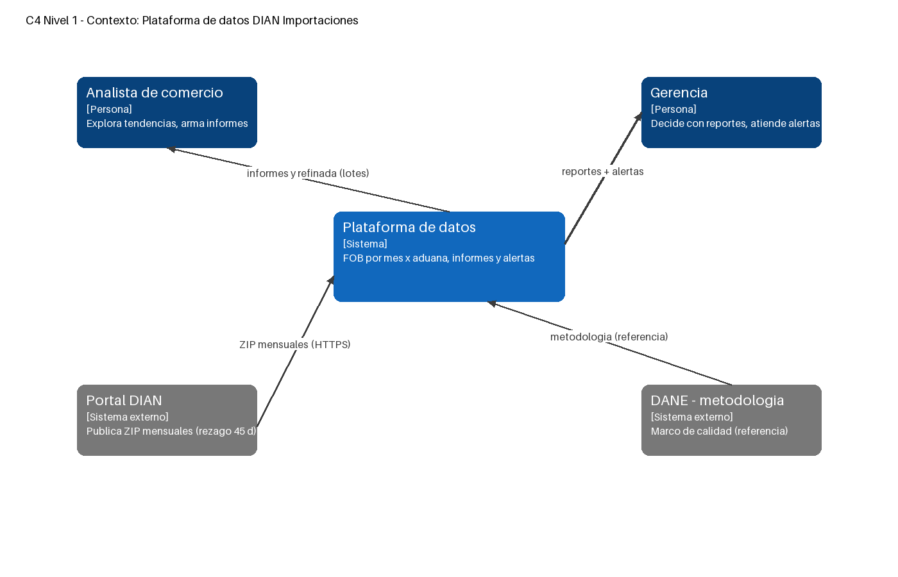
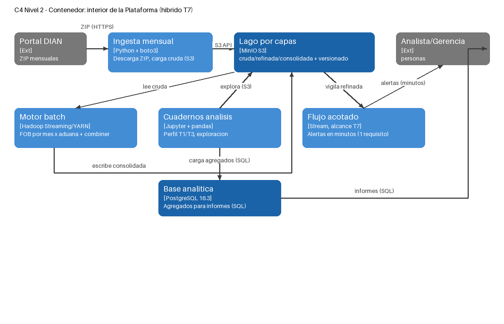

# T8 · Documento de arquitectura del proyecto · Hito A

**Equipo:** DIAN Importaciones
**Integrantes:** Germán Cuesta, Jose Alejandro Hernandez, Juan Camilo Pardo
**Proyecto:** Plataforma de datos DIAN Importaciones
**Fecha:** 2026-09-11

---

## 1. Contexto y fuente de datos

**El sistema.** Plataforma de datos que ingiere las importaciones colombianas publicadas por la DIAN, las organiza en un lago por capas y produce el valor FOB total por mes y aduana, informes de tendencia y alertas de patrones sospechosos, para el analista de comercio exterior y la gerencia.

**La fuente** (ficha T1, `docs/ficha_tecnica.md`): DIAN — Bases Estadísticas de Comercio Exterior, Importaciones; uso libre Ley 1712 de 2014; un `.zip` mensual con un XLSX (no es API Socrata); 2023: 3,428,200 filas / S₀ 2.75 GB; 2024: 3,613,543 filas / S₀ 2.89 GB; g = +5.14 %/año; esquema inestable (166→162 columnas; M49 desde ene-2025, ALADI antes); identificadores solo de personas jurídicas; cifras 2009→hoy provisionales. Todo medido con código sobre los 24 zips reales (`data/mediciones.json`).

---

## 2. Decisión de paradigma

De `docs/T7_paradigma.md` (cifras de frescura exigida y volumen por ciclo):

| Requisito | Frescura exigida | Volumen por ciclo | Paradigma |
|---|---|---|---|
| Procesamiento mensual de declaraciones | días | ~2.89 GB/mes | lotes |
| Validación y calidad de datos | horas | ~2.89 GB/mes | casi real |
| Dashboard de tendencias comerciales | horas | ~100 MB/día | lotes |
| Alertas de patrones sospechosos | minutos | ~10 KB/hora | flujo |
| API de estadísticas históricas | días | variable | lotes |

**Paradigma del proyecto:** híbrido — vía por lotes para todo lo mensual más un componente de flujo acotado solo para las alertas.

---

## 3. Arquitectura de referencia elegida

**Arquitectura elegida.** Vía única sobre el lago con flujo acotado: un solo camino de dato (ingesta → cruda → refinada → consolidada, todo por lotes mensuales) más un componente de flujo acotado que vigila la refinada y emite alertas en minutos.

**Por qué encaja con el paradigma.** Cuatro de cinco requisitos exigen frescura de días/horas y volúmenes mensuales: una vía por lotes los cubre sin pagar streaming. El único requisito de minutos (alertas, ~10 KB/hora) no justifica una vía de flujo completa (Lambda duplicaría el pipeline por un 1 % del volumen): se acota a un vigilante sobre la refinada. La arquitectura es el híbrido de T7 dibujado.

**El costo que aceptamos.** Una sola vía significa latencia de lote para todo lo no-crítico (un informe nunca será más fresco que el último procesamiento mensual) y un lago sin transacciones: sin escritores concurrentes ni viaje en el tiempo (la inmutabilidad de la cruda + versionado cubre la auditoría, ver T5). Es asumible porque la fuente misma publica mensualmente con 45 días de rezago: ninguna arquitectura entregaría frescura que la fuente no tiene.

**Por qué no la malla de datos.** La malla federaliza la propiedad del dato por dominios con equipos independientes (Dehghani, 2022). Aquí hay un solo equipo de tres personas y un solo dominio (importaciones DIAN): no hay dominios que federar ni escala organizativa que lo pida; adoptar la malla sería sobrediseño que multiplica gobierno sin ningún requisito que lo sostenga.

---

## 4. Diagramas C4

Editables en `docs/c4/` (`.drawio`, abren en diagrams.net); PNG regenerables con el script documentado en `docs/c4/`.

**Diagrama de contexto (nivel 1).**

Una sola caja (el sistema), dos personas (analista, gerencia) y dos sistemas externos (Portal DIAN, metodología DANE). Las etiquetas ya insinúan el paradigma: "ZIP mensuales" y "lotes" frente a "alertas".

**Diagrama de contenedor (nivel 2).**

Seis contenedores C4 (ninguno es un contenedor Docker): ingesta mensual (Python+boto3), lago MinIO por capas, motor batch (Hadoop Streaming/YARN), cuadernos (Jupyter+pandas), flujo acotado (alcance T7) y base analítica (PostgreSQL 16.3). La vía por lotes y el flujo acotado conviven: el híbrido hecho dibujo.

---

## 5. Decisiones y compromisos

| Decisión | Elección | Fundamento |
|---|---|---|
| Almacenamiento y factor de réplica | R = 3 (9.12 GB físicos a 12 meses, 25 bloques de 128 MB) | Cálculo T3: S₀ 2.89 GB × (1+g)¹² = 3.04 GB; R=3 porque el dato es pequeño, regenerable con fricción y la copia extra cuesta ~3 GB |
| Modelo de procesamiento | Suma FOB por `mes_aduana` con combiner | T4 medido: mezcla 5,384,912 B → 955 B (−99.982 %), resultados idénticos; sesgo legítimo (top-3 aduanas = 71.1 % del FOB) |
| Formato y codec | Parquet con zstd en refinada | Medición propia T6 sobre el mes real (273,092 filas × 166 cols): CSV 308.6 MB → Parquet zstd 37.3 MB (−87.9 %); lectura selectiva 2.012 s → 0.007 s (~287×); patrón escribir-una-vez-al-mes/leer-mucho |
| Compromiso CAP | Disponibilidad en el sistema de alertas | T7: ante partición se sigue alertando con el último valor conocido; perder una detección cuesta más que un falso positivo leve |

---

## 6. Reproducibilidad

**El stack** (T2): `docker-compose.yml` base (Jupyter `quay.io/jupyter/scipy-notebook:x86_64-python-3.12` sin token en :8888 + Postgres 16.3); `docker-compose.hadoop.yml` (HDFS + YARN con nodemanager propio, receta verificada en `docs/T4_ejecucion.md`); `docker-compose.minio.yml` (lago S3, :9000/:9001). Hadoop y MinIO son mutuamente excluyentes (pelean por el `:9000` del host): uno a la vez.

**La organización del lago** (T5): `cruda|refinada|consolidada`, convención `importaciones_dian/anio=YYYY/mes=MM/dia=DD/archivo`, versionado solo en cruda, regla de inmutabilidad (`docs/T5_lago.md`).

**El repositorio.** https://github.com/Gjaset/dian-comex-pipeline.git — clonar, `cp .env.example .env` (password no vacío), `docker compose up`, correr `notebooks/00_verificacion.ipynb` punta a punta.

---

## 7. Referencias

Brewer, E. A. (2012). CAP twelve years later: How the "rules" have changed. *Computer, 45*(2), 23-29. https://doi.org/10.1109/MC.2012.37

Dean, J., y Ghemawat, S. (2008). MapReduce: Simplified data processing on large clusters. *Communications of the ACM, 51*(1), 107-113. https://doi.org/10.1145/1327452.1327492

Dehghani, Z. (2022). *Data mesh: Delivering data-driven value at scale*. O'Reilly Media.

DIAN. (s. f.). *Bases estadísticas de comercio exterior: Importaciones y exportaciones*. Dirección de Impuestos y Aduanas Nacionales. https://www.dian.gov.co/dian/cifras/Paginas/Bases-Estadisticas-de-Comercio-Exterior-Importaciones-y-Exportaciones.aspx

Kleppmann, M. (2017). *Designing data-intensive applications*. O'Reilly Media.

Machado, I. A., Costa, C., y Santos, M. Y. (2022). Data mesh: Concepts and principles of a paradigm shift in data architectures. *Procedia Computer Science, 196*, 263-271. https://doi.org/10.1016/j.procs.2021.12.013

Reis, J., y Housley, M. (2022). *Fundamentals of data engineering*. O'Reilly Media.

White, T. (2015). *Hadoop: The definitive guide* (4.ª ed.). O'Reilly Media.

---

## Apéndice A · Glosario

Términos técnicos usados en este documento (alimenta el glosario del módulo, iniciado en T3, `docs/proyeccion_almacenamiento.md` § glosario).

| Término | Definición en este proyecto |
|---|---|
| **Lago por capas** | Almacenamiento de objetos (MinIO/S3) organizado en zonas: `cruda` inmutable → `refinada` en formato columnar → `consolidada` lista para consumo. |
| **Cruda / refinada / consolidada** | Capas del lago: la cruda guarda los ZIP de la DIAN tal cual llegan (con versionado); la refinada, el Parquet zstd medido en T6; la consolidada, los agregados FOB por mes×aduana que produce T4. |
| **Paradigma híbrido** | Decisión de T7: vía por **lotes** para los requisitos de frescura días/horas + un componente de **flujo acotado** (un vigilante sobre la refinada) para las alertas en minutos. |
| **Flujo acotado** | Componente de streaming limitado a un solo requisito (~10 KB/hora); no es una vía completa Lambda, que duplicaría el pipeline por el 1 % del volumen. |
| **Frescura** | Tiempo máximo aceptable entre que el dato existe y está disponible para el usuario (días, horas o minutos, según requisito, T7). |
| **R (factor de réplica)** | Número de copias de cada bloque en HDFS. Calculado en T3 para 1, 2 y 3; elegido R = 3 (9.12 GB físicos a 12 meses). |
| **Bloque HDFS (128 MB)** | Unidad en que HDFS divide los archivos; a nuestro volumen le bastan 25 bloques (limitación declarada en T3). |
| **Codec / zstd** | Algoritmo de compresión del Parquet de la refinada; elegido por medición propia en T6 sobre el mes real (csv/gzip/zstd). |
| **Combiner / mezcla (shuffle)** | Etapa del MapReduce de T4 que preagrega en el mapper; redujo la mezcla de 5,384,912 B a 955 B (−99.982 %) con resultados idénticos. |
| **CAP / compromiso CAP** | Teorema de Brewer: ante una partición de red hay que elegir entre consistencia (C) y disponibilidad (A). En las alertas elegimos **A** (T7): se alerta con el último valor conocido. |
| **C4 (contexto/contenedor)** | Notación de diagramas de arquitectura por niveles de abstracción. Nivel 1: el sistema como una sola caja con personas y sistemas externos. Nivel 2: los "contenedores" C4 (piezas desplegables del sistema: ingesta, lago, motor batch, cuadernos, flujo, base) — **no** contenedores Docker. |
| **Regla de inmutabilidad de la cruda** | La capa cruda nunca se modifica ni se borra (solo se añade); con el versionado S3 da auditoría sin transacciones (T5). |

---

## Autoverificación antes de entregar

- [x] La arquitectura elegida se deriva de forma explícita del paradigma de la sección 2.
- [x] Se nombra el costo que se acepta y se descarta la malla con argumento.
- [x] Los dos diagramas C4 respetan las reglas de notación y no confunden el contenedor con Docker.
- [x] Las siete secciones se tejen en un argumento, no se yuxtaponen.
- [x] Cada decisión de la sección 5 tiene su medición o cálculo de respaldo.
- [x] La redacción es clara, el glosario está alimentado y las fuentes se citan en APA 7.
- [x] Los diagramas editables están en el repositorio, no solo como imagen.
